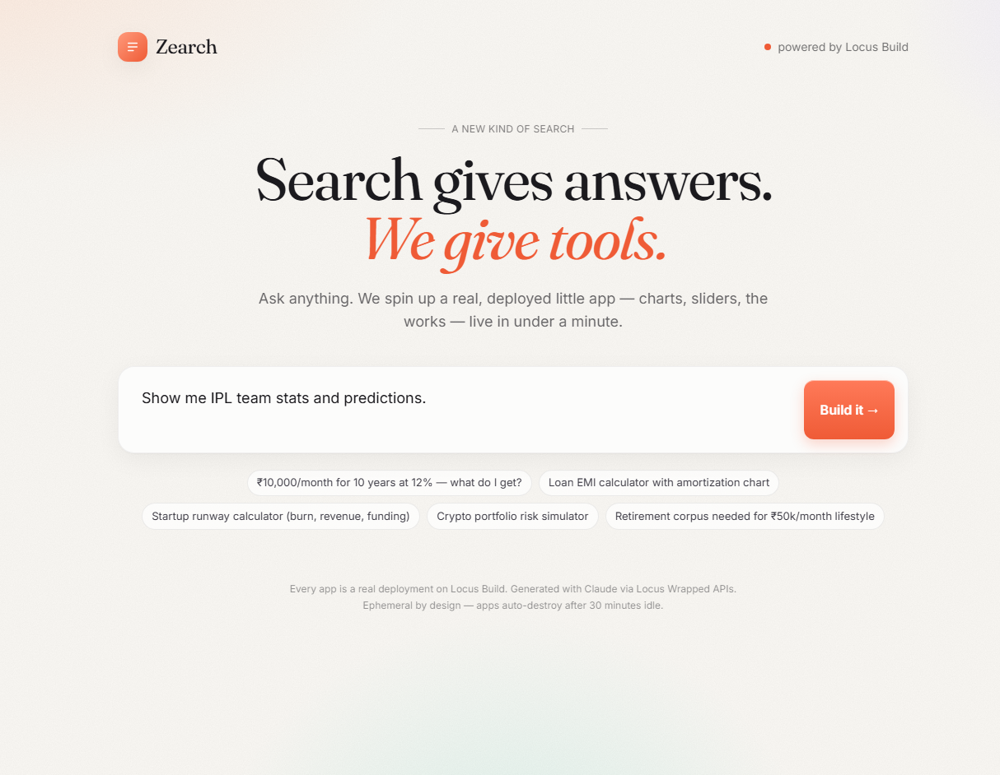
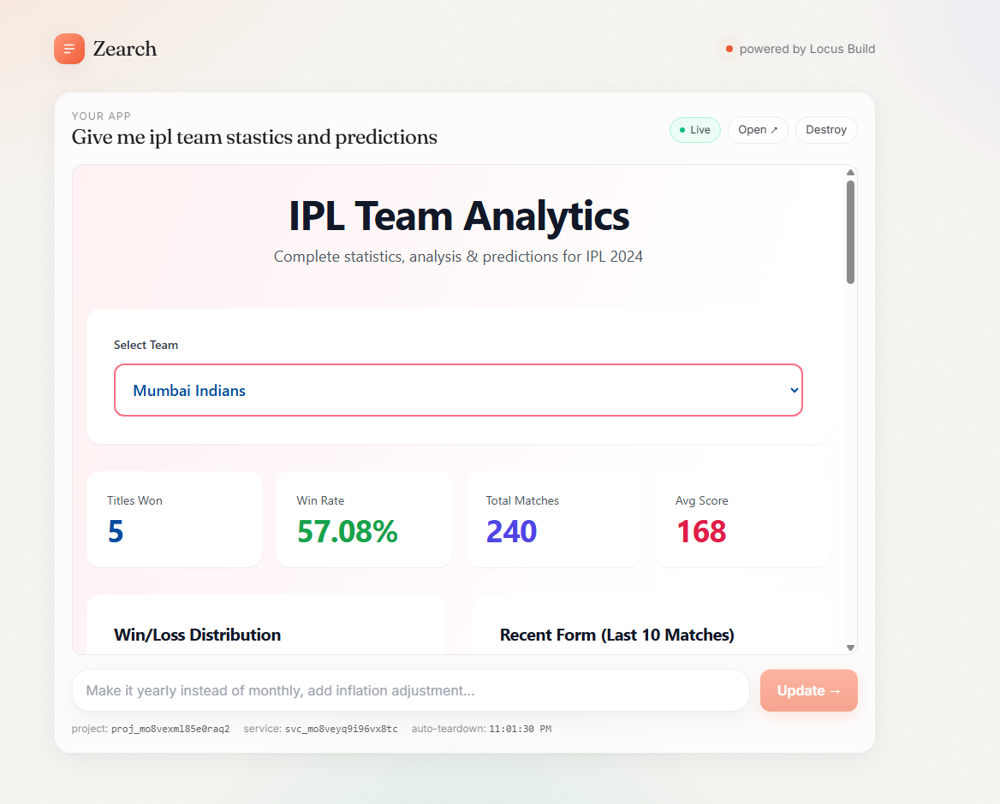
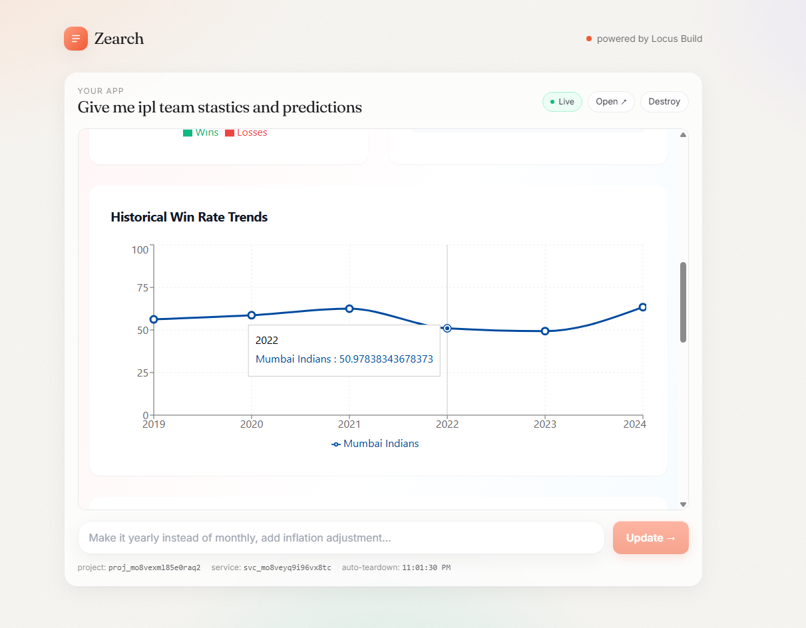
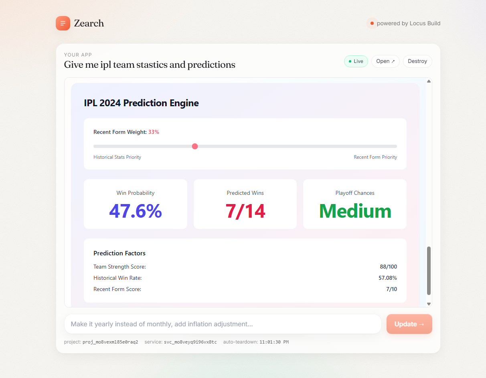

# 🚀 ZEARCH

### A new kind of search.

> Search gives answers. **ZEARCH gives understanding you can touch.**

---

## ✨ What is ZEARCH?

You type a natural-language query — and instead of ten blue links or a wall of text, you get a
**live, interactive web page** that explains, visualizes, and lets you *explore* the topic.

Ask for **"Napoleon Bonaparte"** and you don't get a paragraph — you get a page: a hero with a
portrait, a scrollable timeline of his life, cards for his major battles, a gallery, a legacy
section. The page a knowledgeable friend would build for you if they had ten minutes. ZEARCH
builds it in seconds.

Under the hood, an LLM generates a **single self-contained `index.html`** (React + Tailwind +
Recharts via CDN, transpiled by Babel in the browser). The orchestrator stores it and serves it
at a unique URL, and the page **auto-tears-down after 30 minutes idle**.

---

## ⚡ Demo

Type a query like:

> "Show me IPL team stats and predictions."

<p align="center">
  
</p>

👇 and you get a live, interactive page — not a response:

<p align="center">
  
  
  
</p>

👉 An **explorable, working artifact** generated on demand for your exact query.

---

## 🧩 Page archetypes

Every query maps to an archetype, which decides the page's shape:

- 👤 **Person / biography** — "Napoleon Bonaparte" → hero + portrait, life timeline, key events, gallery, legacy
- 📅 **Event / history** — "French Revolution" → timeline, cause→effect, key figures, map, aftermath
- 🌍 **Place / geography** — "Kyoto" → map, facts panel, photo gallery, things to know
- 🔬 **Concept / science** — "How black holes work" → explainer sections, diagrams, interactive sim
- ⚖️ **Comparison** — "React vs Vue" → side-by-side table, radar/bar charts, verdict
- 📊 **Data / stats** — "IPL team stats" → charts, filters, sortable tables
- 🧮 **Tool / calculator** — "SIP for ₹10k/mo" → sliders, live stat cards, charts

---

## 🏗️ How it works

```text
Prompt
  ↓
Architect (OpenAI function-calling loop) — plans page type, researches topic via tools
  (web_search / wikipedia_summary / image_search) → emits a structured Build Spec
  ↓
Builder (OpenAI generation call) — turns Build Spec into a single self-contained HTML page
  (React + Tailwind + Recharts via CDN, Babel-in-browser); validate + repair loop
  ↓
Orchestrator stores the HTML (memory + disk) and serves it at /app/:id
  ↓
Frontend iframes the live page (follow-up prompts regenerate / refine — Builder-only re-gen)
  ↓
Auto teardown after 30 min idle
```

No containers, no git-push deploy — because the generated app is a single self-contained HTML
file, "hosting" just means storing the HTML and serving it natively from the orchestrator.

---

## 🧰 Tech stack

- 🤖 **OpenAI** — LLM for all calls (Architect tool loop + Builder generation); `gpt-4o-mini` default, swappable via `OPENAI_MODEL`
- 🟢 **Node.js + Express** (TypeScript, ESM, run via `tsx`) — orchestrator backend (`:8080`)
- ⚛️ **Vite + React 18 + Tailwind** — frontend SPA (`:5173` dev)
- 🎨 **React + Tailwind + Recharts via CDN** — the generated pages (Babel-in-browser)
- 📦 **npm workspaces monorepo** — `apps/orchestrator`, `apps/frontend`, `packages/shared`

---

## 🚀 Getting Started

1. **Clone the repo**
   ```
   git clone https://github.com/XZNON/ZEARCH.git
   cd ZEARCH
   ```
2. **Install dependencies** (from the repo root — installs all workspaces into one hoisted `node_modules`)
   ```
   npm install
   ```
3. **Set environment variables** — create a `.env` file at the **repo root**:
   ```
   OPENAI_API_KEY="your_openai_api_key"
   TAVILY_API_KEY="your_tavily_api_key"
   ```
   Optional overrides (see `CLAUDE.md` for the full list): `LLM_PROVIDER` (`openai` default), `OPENAI_MODEL` (default `gpt-4o-mini`), `PUBLIC_BASE`, `PORT`. Use `KEY="value"` form.
4. **Run** (orchestrator on `:8080` + frontend dev server on `:5173`, in parallel)
   ```
   npm run dev
   ```

Other root scripts:
```
npm run dev:orch     # orchestrator only (:8080)
npm run dev:web      # frontend only (:5173)
npm run build        # build every workspace that has a build script
npm run typecheck    # tsc --noEmit across all workspaces (the only static check)
npm start            # orchestrator (tsx, production-ish)
```

Orchestrator API: `http://localhost:8080`  
Frontend: `http://localhost:5173`

---

## 🛣️ Roadmap

- [x] **Agentic pipeline** — Architect tool loop → Build Spec → Builder with validate/repair loop
- [x] **Archetype routing** — Architect decides page type; per-archetype render contract
- [x] **Grounding** — real Wikipedia facts + Wikimedia images in every Build Spec
- [x] **Render reliability** — validate/repair loop; broken pages never reach the iframe
- [x] **Live data** — generated pages can fetch live APIs through /api/live proxy with snapshot fallback
- [ ] **Persistence & sharing** — opt-in "keep this page" shareable links
- [ ] **Search history** — recents strip, repeat-query caching

---

## 🎯 Use cases

- 🧠 Learn a person, event, place, or concept as an explorable page
- ⚖️ Compare two things side by side
- 📊 Turn data/stats into interactive charts and tables
- 🧮 Spin up a quick calculator or simulator
